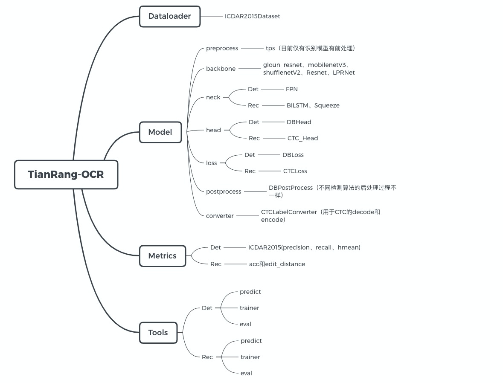

# TianRang-OCR

TianRang-OCR致力于打造一个实用的OCR工具库，集成常见的OCR算法，通过模块化的设计、高灵活性、高拓展性，提升实验效率、生产效率。

## Result

- [CCPD数据集简介及车牌识别结果](wiki/CCPD数据集简介及结果.md)

## 开始训练

- [数据集准备](wiki/数据集准备.md)
- [config配置](wiki/config配置示例.md)
- [训练、验证、推理](wiki/训练、验证及推理.md)

- 导出模型：`python -c "python -c "from utils.utils import export_model; export_model('output/shufflenet05_rec/checkpoint/model_best.pth', 'weights/rec_shufflenet.pth')""`

## 车牌识别服务

### Flask部署

[Flask部署](wiki/车牌识别服务部署文档.md)

### 部署接口文档

[部署接口文档](wiki/车牌识别服务部署文档.md)

### Flask Web demo

参数参考flask部署文档

`python app_demo.py --port 8484 --rec_model_path weights/rec_res18.pth`

## 近期更新

- 2020.6.23初次提交

- [more](wiki/更新.md)

## TO DO

### BackBone

- [ ] 支持glouncv Resnet
- [ ] mobilenetv3支持检测模型（目前仅支持识别）

### 识别算法

- [ ] Attention

### 检测算法

- [ ] PSENet
- [ ] EAST
- [ ] YOLO

### Dataloader

- [ ] LMDB：文字识别训练，现在效率太低
- [ ] CTW1500

### 其他

- [ ] 识别训练过程tensorboard
- [ ] 多卡训练识别模型
- [ ] 更多开源数据集的训练结果
- [ ] API文档
- [ ] Dockerfile
- [ ] requirements.txt
- [ ] 文档！文档！文档！！！！

